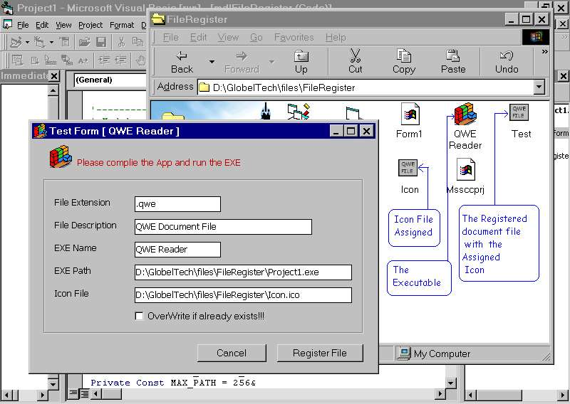



## FileRegister \- \[ Want to execute your software when clicking it's document file??? \]

### Description

[ How to set OpenWith??(!) ] - You can launch your software when user clicks on it's document file... like clicking on "*.txt" file will execute "NOTEPAD.exe". For that you need to register your document file extension and set it to be executed with your software. A simple implimentation with very easy to use code!!!. Please compile the code and run the EXE to test it. Good luck!!!, Jim Jose :-))
 
### More Info
 

             |
---                |---
**Submitted On**   |2005-07-07 22:55:46
**By**             |[JJJJJJJJ](https://github.com/Planet-Source-Code/PSCIndex/blob/master/ByAuthor/jjjjjjjj.md)
**Level**          |Intermediate
**User Rating**    |5.0 (30 globes from 6 users)
**Compatibility**  |VB 6\.0
**Category**       |[Files/ File Controls/ Input/ Output](https://github.com/Planet-Source-Code/PSCIndex/blob/master/ByCategory/files-file-controls-input-output__1-3.md)
**World**          |[Visual Basic](https://github.com/Planet-Source-Code/PSCIndex/blob/master/ByWorld/visual-basic.md)
**Archive File**   |[FileRegist1915007192005\.zip](https://github.com/Planet-Source-Code/jjjjjjjj-fileregister-want-to-execute-your-software-when-clicking-it-s-document-file__1-61693/archive/master.zip)

